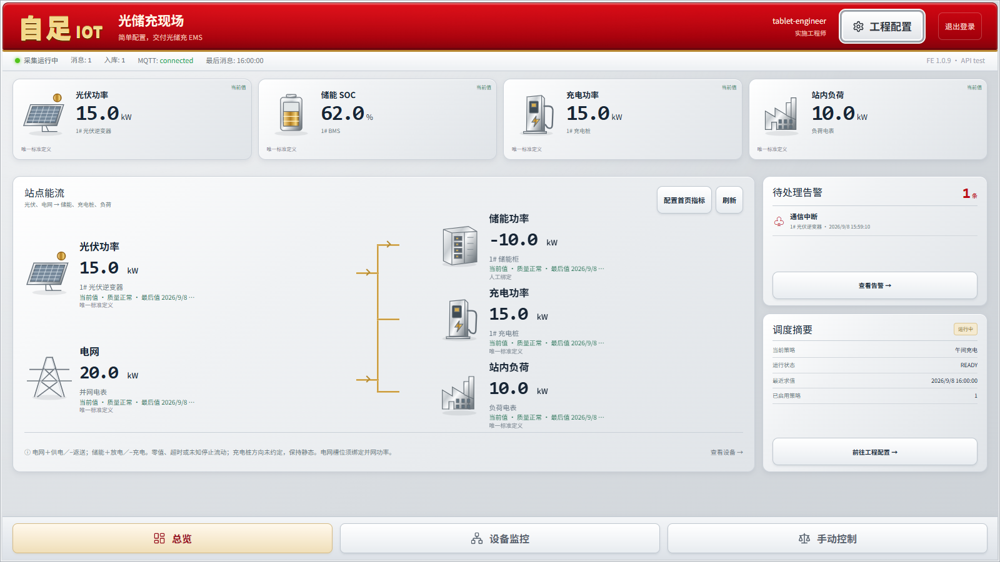

# ZiZu

A configuration-driven industrial IoT platform for building and delivering energy management systems.

ZiZu lets an implementation engineer model physical assets, connect device points, process raw data into stable entities,
and configure alarms, dispatch strategies, control, and a fixed EMS workbench without changing platform source code or writing
SQL. A solar-storage-charging EMS is the first reference delivery.

**Current code version: `v1.0.9`** · [中文](README.md) · [Full bilingual architecture](docs/ZIZU-TECHNICAL-ARCHITECTURE.md)

Host 1 now runs v1.0.9 with Schema 065, healthy application status, and ten passing read-only headless trunk checks. The overview follows the approved Demo: four metric cards, five energy nodes, skeuomorphic SVG icons, red-gold-bright-silver styling, and an independent site-load binding. Production pages still consume formal APIs and committed L2. Recent releases also add compact strategy management, safe hard deletion, and collapsed control-readback details. See the [deployment record](docs/deploy-1号机-v1.0.9-http.md) and [overview behavior](docs/workbench-demo-overview.md).

[v1.0.4 integration, release, and field verification record (Chinese)](docs/reviews/2026-09-07-tablet-production-acceptance.md) · [Historical v0.9.9 field record (Chinese)](docs/deploy-1号机-v0.9.9-http.md)

This deployment changed no field metric bindings and issued no device controls. Some metrics still show last-known values; charging and load remain unbound. The visible-browser plugin spot check remains incomplete. Code capability, deployment, and read-only acceptance are distinct from full field delivery.

> ZiZu has the core data trunk plus alarm and dispatch/control foundations, but it is not yet a complete delivery-ready solar-storage-charging EMS. Real-device control and full EMS field acceptance still require separate evidence.

## Latest runtime homepage

The approved visual direction combines **flag red, gold, and bright silver** with skeuomorphic panels for a 10.1-inch tablet: daily operations come first, with engineering configuration grouped under one entry point.



> Captured from the v1.0.9 production frontend build, not the old Demo. Sample data based on public repository test fixtures protects field information; the API version therefore reads `test`. Devices, values, and strategies are examples, not field evidence. Production sites still distinguish current, last-known, and unconfigured states and are never filled with this sample data.

## Core structure

```text
Physical node tree → L0 raw points → L1 point processing → L2 global entities
                                                        ↓
                                  Alarms / Dispatch strategies / Control / Fixed EMS workbench
```

| Part | Purpose | What the user sees |
|---|---|---|
| Physical node tree | Represents sites, subsystems, and real equipment | Solar, storage, charging, grid, load, and their devices |
| L0 raw points | Preserves values, quality, time, and source received from equipment | Live data, history, and link health |
| L1 point processing | Performs mapping, conversion, state decoding, composition, and typed formulas | How raw points become standard entities |
| L2 global entities | Provides stable business semantics to every upper function | Live values, history, quality, and provenance |
| Upper applications | Operate exclusively on L2 | Alarms, dispatch strategies, control, and the EMS workbench |

L0, L1, and L2 are three data views attached to a selected physical node, not three kinds of child node. Points, formulas,
and entities never become physical tree levels. The normal engineering UI mainly exposes **Raw Data** and **Standard
Entities**: select L0 inputs, define processing, preview the result, and publish L2. A reusable processing template is
optional for repeated equipment and is not required for the first device.
Numeric write points become controllable L2 targets only through one direct Neuron `RW` binding with explicit safety limits, readback tolerance, cooldown, and timeout.

### Runtime data flow

```text
Device → Neuron → NanoMQ → real-time blackboard → committed frame → L1 → committed L2
                                                                            ↓
                                                        Alarms / Dispatch strategies / Control / UI
```

- One active ingestion writer runs per site; the in-process blackboard freezes immutable frames on a default one-second tick.
- A frame is created for new observations or quality changes. An unchanged value with a new sample timestamp is still a new observation; duplicate, regressive, and late samples are discarded.
- Before the database commit, ZiZu does not push UI data, transition alarms, execute JDM, or issue control.
- Quality is `GOOD`, `UNCERTAIN`, `BAD`, or `STALE`; non-`GOOD` data cannot drive automatic control.
- Every L2 fact is traceable to L0 observations, an L1 revision, a configuration revision, quality, and time evidence.
- Upper applications consume only committed L2, never vendor addresses or raw MQTT.

## Modules

| Module | Main capabilities |
|---|---|
| Runtime home and device monitoring | Real nodes and committed L2, device filters, six-card pages, 10/20-row entity details, history and provenance, with current/last/unknown states kept distinct |
| Nodes and data | Physical-node CRUD, Neuron point import, L0 live/history, link diagnosis, processing, and L2 live/history/provenance |
| Alarms | L2 rules, severity, trigger/recovery, multi-code faults, 10/20-row events, current-page batch acknowledgement, archive, HTTP notifications, and delivery records |
| Dispatch strategies | Bind multiple L2 inputs, edit native GoRules JDM, and bind multiple controllable L2 outputs; draft, simulate, publish, enable/disable, inspect decisions, intents, and readback; 2-charge/2-discharge is only an optional starter |
| Control | One safe path for human and strategy intent, one L0 write point, and confirmation through new L2 readback |
| Fixed EMS workbench | Existing power, SOC, trends, and alarms organized by node and standard L2; missing site-level L2 is shown as unconfigured rather than filled with Demo data |
| System tools | MQTT, HTTP notifications, runtime health, and administrator configuration |

ZiZu deliberately excludes multi-tenancy, solution packages, a device-instance middle layer, a second rules engine,
arbitrary scripts, Redis, Kafka, additional microservices, and a free-form page designer. Statistical calculations are L1
processing rules whose results remain ordinary L2 entities; there is no separate statistical-entity layer.

## How to use ZiZu

### 1. Model the site

In **Nodes and Data**, create the site, subsystems, and equipment according to their physical relationships. Keep points
and formulas out of the node tree.

### 2. Connect raw points

Configure Neuron for the equipment and import its points on the device node. In **Raw Data**, verify:

- the expected points exist;
- current value, data time, and receive time keep advancing;
- quality is `GOOD`;
- the `Neuron → MQTT → ingestion → frame → L0` path is connected;
- live and historical views show the same point identity.

L0 preserves the protocol value. If equipment sends `0/1`, L0 shows `0/1`; boolean meaning, fault codes, and unit
conversion belong in L1.

### 3. Produce global entities

Select one or more L0 points, then enter the entity name, stable definition key, result type, and unit. Choose a processing
method:

- direct use;
- scale and offset;
- enum or state decoding;
- multi-point composition;
- a strongly typed formula;
- cross-node calculation, whose remote inputs must be L2.

Run **Check Result** before publication to verify bindings, types, units, quality propagation, and the preview value. After
publication, inspect the L2 live value, history, and provenance in **Standard Entities**. Save the processing as a reusable
template only when a second device of the same kind needs it.

For a numeric local L0 with no declared unit, **Direct Use** can explicitly declare its true engineering unit. For an
existing entity, use **Standard Entities → Templates and Versions → Edit Current Processing**, fill the output unit,
check, and publish. This does not rescale values or change L0, entity identity, history, or control limits. Known units,
boolean values, and cross-node L2 inputs cannot be relabeled this way. Release control ownership or dependent node
processing before changing a unit they use.

### 4. Configure upper applications

- In Alarms, select L2 entities and configure severity, trigger, recovery, and duration; bind an HTTP notification when needed.
- The generic dispatch path is: bind one or more committed-L2 inputs with unique aliases → edit the native JDM decision table → bind output aliases to confirmed, controllable L2 targets with safety contracts.
- A new generic table uses native GoRules `collect` with an `intents` output. Each matching row emits an explicit `action_id` and `target`; duplicate actions or entities in one result fail closed.
- Save draft, simulate, publish, and enable are separate operations. Simulation shows snapshot evidence, matches, and proposed intents but never writes a device. Publication freezes an immutable revision; enablement is explicit.
- The complete JDM graph remains the sole source of truth. The native table is used only for one table that can round-trip losslessly; complex graphs remain in the full graph editor and are never silently rewritten.
- The 2-charge/2-discharge starter remains optional and keeps its dedicated SOC, unit, power-target, and safety validation. Previously stored graphs that use invalid `&&` cells are not migrated automatically; edit them to native GoRules ranges, then save, simulate, and republish explicitly.
- Configure one write point, limits, interlocks, permission, timeout, and readback for every controllable L2. API acceptance, a JDM match, or a UI refresh is not device success; only matching new committed-L2 readback is success.
- Let the fixed EMS workbench bind stable L2 semantics rather than vendor addresses.

### 5. Verify and deliver

Accept the system along one fixed path:

```text
Node → L0 live/history → L1 check and publish → L2 live/history/provenance
     → Alarm → Dispatch strategy → Control readback → EMS workbench
```

Lock the platform version, image digest, database Schema, template digests, and configuration revision. Verify backup and
restore, disconnects, `STALE`, process restart, and concurrent configuration changes. See the
[acceptance checklist](docs/acceptance-checklist.md).

## Quick start

### Requirements

- Docker and Docker Compose
- Python 3.12+
- A reachable Neuron instance when industrial protocols are required

### Start locally

```bash
git clone https://github.com/taidai/zizu.git
cd zizu
python scripts/bootstrap_runtime_secrets.py
docker compose up -d --build
docker compose ps
```

Create the only initial platform administrator. The command reads the password interactively without echo:

```bash
docker compose exec backend python -m scripts.bootstrap_admin --username admin
```

The default configuration enforces production security and HTTPS. Only on a fully isolated development machine may these
three values be set together in `.env`:

```env
DEPLOYMENT_MODE=development
ALLOW_INSECURE_DEV_SECRETS=true
AUTH_REQUIRE_HTTPS=false
```

Then open `http://127.0.0.1:9000`. Production requires a TLS entry point, private credentials, and an immutable image
digest—never `latest`. Use `deploy/docker-compose.release.yml` for a normal host and
`deploy/docker-compose.release.e606.yml` for the constrained e606 kernel.

Common operations:

```bash
docker compose ps
docker compose logs -f backend
docker compose restart backend
docker compose down
```

`docker compose down` preserves volumes. Do not use `down -v` unless permanent deletion of database and runtime data is
explicitly intended.

## Development and verification

Backend:

```bash
cd backend
python -m pip install -e .
python -m unittest discover -s tests -p 'test_*.py'
```

Frontend:

```bash
cd frontend
npm ci
npm run dev
npm run build
```

After configuring the target URL and test identity, run headless acceptance:

```bash
cd frontend
npm run test:e2e:node
npm run test:e2e:alarm-http
npm run test:e2e:dispatch-strategy
```

Before a commit or release, follow the [acceptance checklist](docs/acceptance-checklist.md) and exercise
`Node → L0 → L1 → L2 → Alarm`. A page opening successfully is not evidence that an industrial system is delivery-ready.

## Technology

| Layer | Technology |
|---|---|
| Protocol integration | Neuron |
| Message bus | NanoMQ / MQTT |
| Backend | Python 3.12, FastAPI |
| Database | PostgreSQL, TimescaleDB |
| Decisions | GoRules ZEN / JDM |
| Frontend | React 18, TypeScript, Vite, ECharts |
| Deployment | Docker Compose, immutable image digests |

## Documentation

- [Bilingual technical architecture](docs/ZIZU-TECHNICAL-ARCHITECTURE.md)
- [Core architecture specification](docs/superpowers/specs/2026-08-27-zizu-platform-core-architecture-design.md)
- [Domain language](CONTEXT.md)
- [Architecture decision records](docs/adr/)
- [Acceptance checklist](docs/acceptance-checklist.md)
- [v1.0.4 integration, release, and field verification record (Chinese)](docs/reviews/2026-09-07-tablet-production-acceptance.md)
- [Historical v0.9.9 field deployment record (Chinese)](docs/deploy-1号机-v0.9.9-http.md)

If documents disagree, read them in this order: core architecture specification, latest accepted ADR, current subsystem
specification, then historical records.

## License

ZiZu is licensed under the repository's [Daśa-kuśala License 1.0](LICENSE). Read the full terms before use,
modification, or distribution; the license includes use restrictions and distribution obligations.
